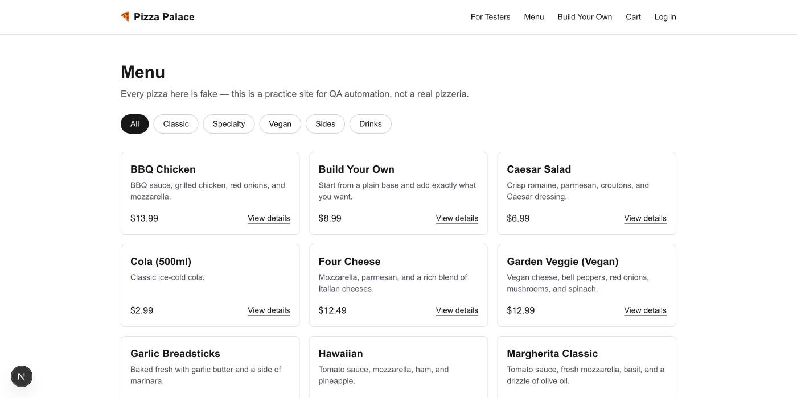
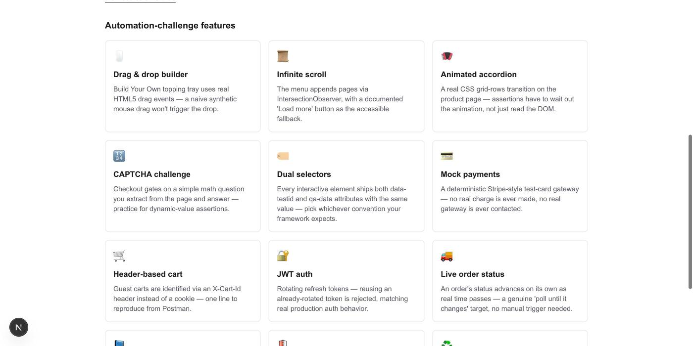

# Pizza Palace — QA Automation Practice Site

A free, open pizza-ordering website built specifically for practicing UI automation
(Selenium, Playwright, Cypress) and API automation (Postman, RestAssured, etc.).
It's a fake shop, not a real one — no real orders, no real payments, no real pizza.

|                          A real (fake) pizza shop...                          |                     ...built for testers, not shoppers                      |
| :-----------------------------------------------------------------------------: | :---------------------------------------------------------------------------: |
|                                       |                      |

## Stack

- **apps/web** — Next.js (App Router) frontend
- **apps/api** — NestJS backend, with a public Swagger doc at `/api/docs`
- **packages/shared-types** — DTOs/enums shared between frontend and backend

```
                 ┌────────────────────┐        ┌─────────────────────┐        ┌────────────┐
   browser  ───▶ │ apps/web (Next.js) │ ─────▶ │ apps/api (NestJS)    │ ─────▶ │  Postgres  │
                 │  :3059             │        │  :3053, /api/v1/...  │        │            │
                 └────────────────────┘        └─────────────────────┘        └────────────┘
                                                          ▲
                                                          │ POST /api/test/reset
                                                          │ (X-Test-Reset-Secret header)
                                                ┌─────────────────────┐
                                                │ GitHub Actions       │
                                                │ nightly-reset.yml    │
                                                │ (manual dispatch     │
                                                │  until Phase 8)      │
                                                └─────────────────────┘
```

## Local development

```bash
pnpm install
docker compose up -d      # starts Postgres on localhost:5432
pnpm dev                  # runs web + api in parallel via Turborepo
```

- Web: http://localhost:3059
- API: http://localhost:3053/api
- Swagger docs: http://localhost:3053/api/docs
- Health check: http://localhost:3053/api/v1/health

Seed the database with `pnpm --filter @pizza/api db:seed` (catalog, coupons, and demo accounts below).

### Testing utilities

With `ENABLE_TEST_UTILS=true` set (see `apps/api/.env.example`), two extra endpoints are available:

- `POST /api/test/reset` — wipes every table and reseeds the original demo baseline (catalog, coupons, demo accounts). Requires a `X-Test-Reset-Secret` header matching `TEST_RESET_SECRET`.
- `POST /api/test/seed-demo-user` — re-creates the two demo accounts if they were edited or deleted. No secret required.

Full details, plus test card numbers and the API docs link, are on the [`/for-testers`](http://localhost:3059/for-testers) page once the web app is running.

## Demo accounts

For manually testing without registering a fresh account each time:

| Role     | Email                        | Password       |
|----------|------------------------------|----------------|
| Admin    | `admin@pizzapalace.test`     | `Admin123!`    |
| Customer | `customer@pizzapalace.test`  | `Customer123!` |

Log in at `/account/login`. The admin account can visit the admin panel at `/admin` (an "Admin" link also appears in the header nav once logged in); the customer account is a plain shopper for exercising menu browsing, cart, checkout, order history, and reviews.

## Source code

> **TODO**: `https://github.com/YOUR_USERNAME/pizza-palace` is a placeholder — replace it (here, in the site footer, and on `/for-testers`) with the real repo URL once this project is pushed to GitHub.

## License

MIT
